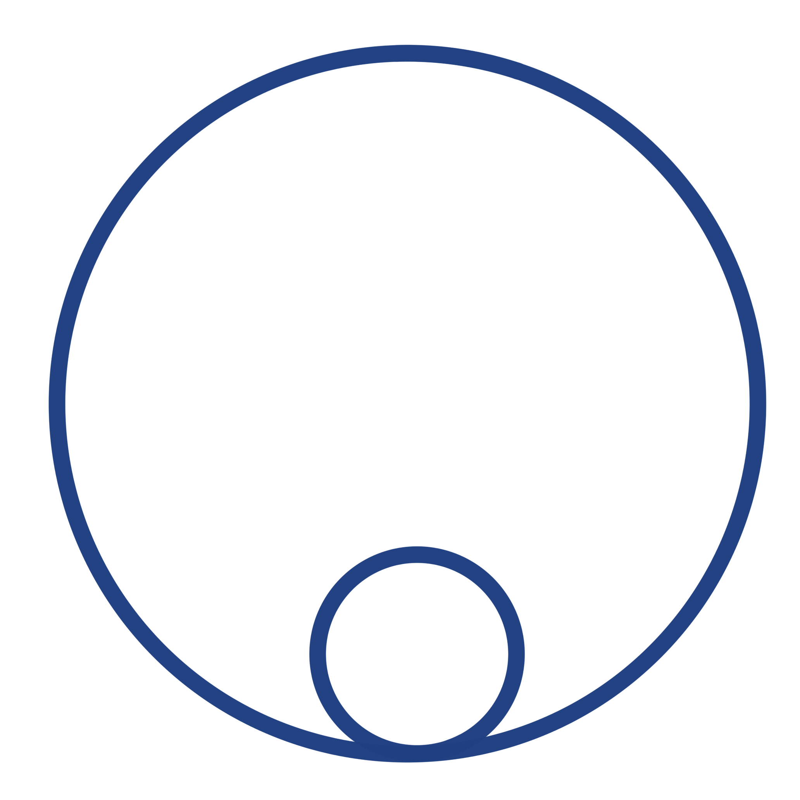

# Welcome to Aegraph 🚀

<!-- {: width="64" height="64"} -->
<iframe src="https://aegraph.dev" width="100%" height="600px" style="border: none;"></iframe>

## Quick Links

**Live Demo**: [https://aegraph.dev](https://aegraph.dev) 
**Repository**: [https://github.com/aesgraph/aegraph](https://github.com/aesgraph/aegraph) 
**Discord**: <https://discord.gg/8MxDDNjvsq> 
Chrome Extension: [Coming Soon]

{: .highlight }
⚠️ This project is under active development and far from complete. Please consider all presented material a work-in-progress towards an mvp.

{: .highlight }
⚠️ The app embedded in this webpage is cut off on the right side, the css needs to be updated.

Aegraph is both a deep technology, and an attempt to materialize it. It aims to productize itself as a means to build interest and community, but its final intention is far beyond. It aims to build a field-theoretic framework for application ecosystems centered on human-centric graph-based modeling, interaction, and information exchange.

Aegraph's first aim is to create an accessible platform for graph-based application software and information exchange.
**The MVP centralizes accessibility to various existing diagramming tools and features in a single state-of-the-art web application.**

{: .highlight }
⚠️ Performance Note  Aegraph performs a wide range of complex operations in real time, and as a result, it is naturally resource-intensive. It’s designed to support highly interactive graph-based workflows, which can be demanding on both CPU and memory.  The application is primarily developed and tested using Chrome on an Apple M2 system with 16GB of RAM. While performance optimizations are planned, our current focus is defining the product and building out core features. In the meantime, we recommend using modern hardware and running Aegraph in Chrome for the best experience.

[Go to Overview](./overview/overview.md)
